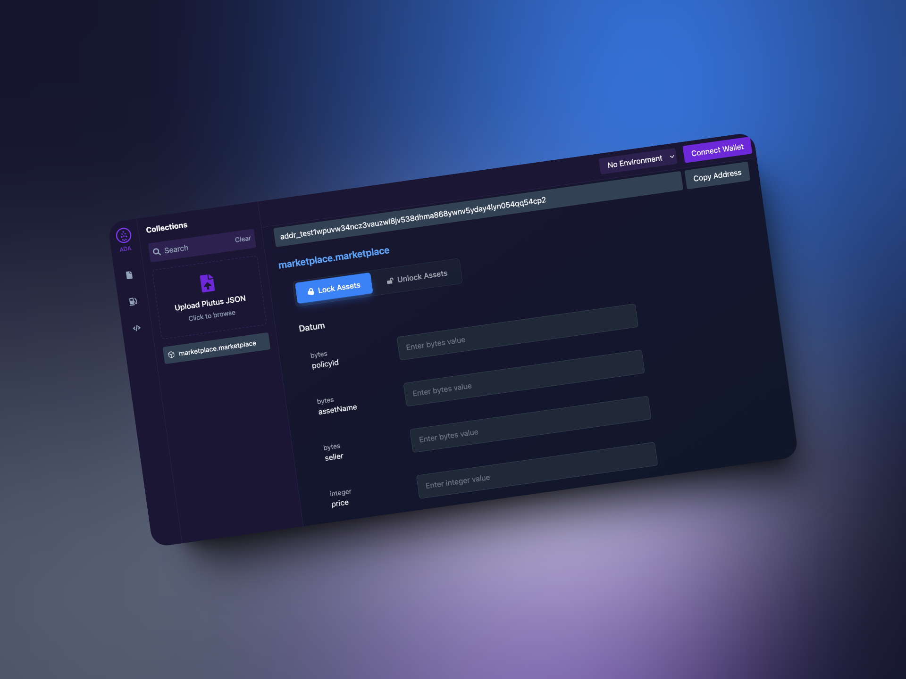

# 🎯 Aiken Tool - Your Smart Contract Companion

> Unleash the power of Cardano smart contracts with an intuitive testing interface

## ✨ What is Aiken Tool?

Think Postman, but crafted specifically for Cardano smart contracts. This powerful interface lets Aiken developers test and interact with their contracts seamlessly, without writing a single line of test code. Simply feed it your `plutus.json` file and watch the magic happen!

## 🚀 Key Features

- 🎭 **Smart Interface** - Dynamic forms that adapt to your `plutus.json` schema
- 🔌 **Direct Integration** - Interact with contracts straight from the UI
- 👛 **Wallet Support** - Seamless connection with popular Cardano wallets
- 🪙 **Token Factory** - Mint NFTs and tokens with ease
- ✅ **Contract Testing** - Validate your contracts without hassle

## 🏃‍♂️ Quick Start

### Before You Begin

Make sure you have:
- 📦 Node.js (v18+)
- 🔧 NPM or Yarn
- 💼 A Cardano wallet (Nami/Eternl)
- 🛠️ Aiken compiler
